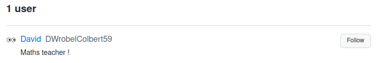
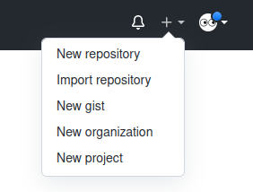
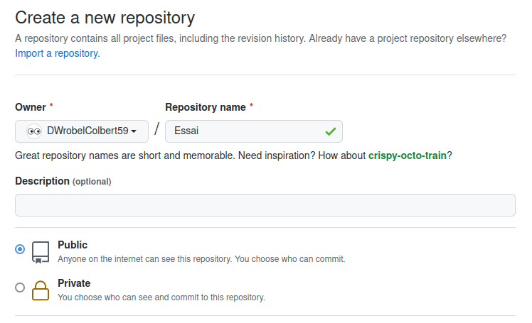
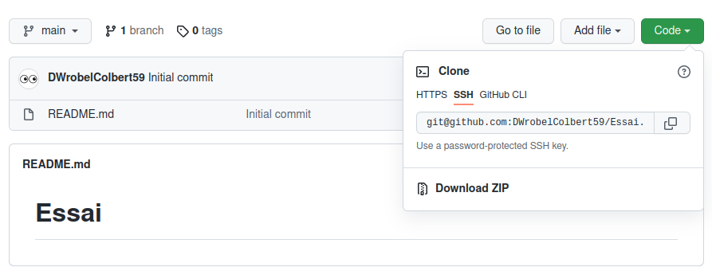
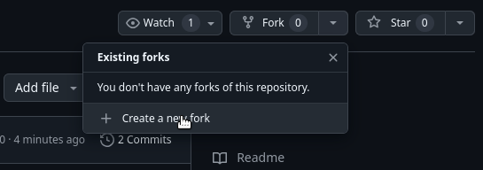

# Le jeu de la Bataille

## Des outils pour collaborer

GitHub est un service web d’hébergement et de gestion de
développement de logiciels, utilisant le logiciel de gestion de
versions Git. Il permet de développer de façon coopérative
un même projet et de simplifier la mise en commun de
fragments de code apportés par chaque collaborateur.

<center>
    
</center>

!!! note "Important"

    GitHub est depuis 2018, une propriété de Microsoft.

### Bienvenue sur GitHub

Commencer par vous rendre sur le site [GitHub](https://github.com) et y créer un compte.

<center>
    
</center>

!!! danger "Attention"

    Vous choisirez un nom d'utilisateur de la forme **InitialePrénomNomColbert59**.  

    Par exemple, **Jacques Chirac** devrait choisir **JChiracColbert59**.

Une fois inscrit sur GitHub, rechercher l’utilisateur **DWrobelColbert59** et suivez cette personne.

<center>
    
</center>

<center>
    
</center>

### Un premier projet

Créer à présent un nouveau projet en cliquant sur **New repository** dans le menu en haut à droite.  

<center>
    
</center>

Donner lui le nom **Essai**, le rendre **public** et ajouter un fichier **README**.

<center>
    
</center>

Un des intérêts de GitHub est de pouvoir synchroniser un Projet présent sur le site avec un dossier local de
l’ordinateur que vous utiliser. Pour cela, il faut permettre à votre ordinateur de se connecter à votre session
GitHub. On utilise alors une clé SSH.

!!! question "Étapes à suivre"

    1. Ouvrir un terminal (Ctrl+Alt+T)
    2. Entrer la commande 

        ``` bash title="Génération d'une clé SSH" linenums="1"

        ssh-keygen -t ed25519 -C "your_email@example.com"
        ```
    3. Valider trois fois de suite
    4. Entrer la commande

        ``` bash title="Copier le contenu dans le presse-papier" linenums="1"

        xsel -b < .ssh/id_ed25519.pub
        ```
    5. Dans les paramètres de votre compte GitHub, sélectionner **Clé SSH**
    6.  Choisir **New SSH Key** et coller le contenu du presse-papier à l’emplacement adéquat.
    7. Entrer la commande

        ``` bash title="Tentative de connexion" linenums="1"

        ssh -T git@github.com
        ```

Il est temps à présent de récupérer une version locale de votre projet **Essai**.

!!! question "Étapes à suivre"

    1. Ouvrir un terminal (Ctrl+Alt+T)
    2. Placer vous dans **Documents**

        ``` bash title="Déplacement" linenums="1"

        cd Documents
        ```
    3. Créer un répertoire **GitHub**

        ``` bash title="Création d'un répertoire" linenums="1"

        mkdir GitHub
        ```
    4. Placer vous dans **GitHub**

        ``` bash title="Déplacement" linenums="1"

        cd GitHub
        ```
    5. Dans votre projet **Essai** sur **GitHub**, cliquer sur **Code** puis **SSH** puis copier le lien proposé.

        <center>
            
        </center>
    6. Retourner sur le Terminal et entrer la commande 

        ``` bash title="Clonage" linenums="1"

        git clone (coller le lien) (Ctrl+Alt+V)
        ```
    7. Observer le dossier **Essai** qui vient d’être créé dans le dossier **GitHub**

#### Modification du projet local

!!! question "Étapes à suivre"

    1. Ouvrir Thonny et coller le code suivant :

        ``` python title="Fonction quelconque" linenums="1"

        def f(x):
            return x**2
        ```
    2. Enregistrer ce fichier dans votre dossier **Essai** avec le nom de votre choix.

Pour mettre à jour votre projet en ligne, procéder comme suit :

!!! question "Étapes à suivre"

    1. Réaliser un clic droit dans votre dossier **Essai** et choisir **Ouvrir avec un Terminal**
    2. Taper la commande :

        ``` bash title="Chargement tampon" linenums="1"

        git add .
        ```
    3. Taper la commande :

        ``` bash title="Ajout d'un message" linenums="1"

        git commit -m "Ajout d'un fichier"
        ```
    4. Taper la commande :

        ``` bash title="Envoyer le tout" linenums="1"

        git push
        ```

Vérifier à présent que votre projet en ligne contient un nouveau fichier.

#### Modification du projet en ligne

Lorsque vous collaborez, un partenaire peut modifier un des fichiers de votre dépôt. Il est alors important que vous puissiez travailler avec la dernière version de votre projet.

!!! question "Étapes à suivre"

    1. Rendez-vous sur votre projet sur GitHub
    2. Modifier le fichier python que vous avez inséré et ajoutez-y le code :

        ``` python title="Nouvelle fonction" linenums="1"

        def g(x):
            return x**3
        ```
    3. Sauvegarder le tout
    4. Dans le terminal (dans le dossier Essai) tapez la commande :

        ``` bash title="Récupérer le tout" linenums="1"

        git pull
        ```
    5. Observer votre fichier python.

## Le jeu de la Bataille

Commencer par aller sur le profil de l'utilisateur **@DWrobelColbert59** et cliquez sur son projet **2024-bataille**.

Il est possible de récupérer une copie de ce projet en le **Forkant**.  
Pour cela cliquer sur **Fork** et valider l'ensemble.

<center>
    
</center>

!!! question "Étapes à suivre"

    1. Il vous reste à cloner ce projet pour en obtenir une version locale.
    2. Complétez ensuite le code proposé.
    3. N'oubliez pas de synchroniser votre travail avec la version en ligne.